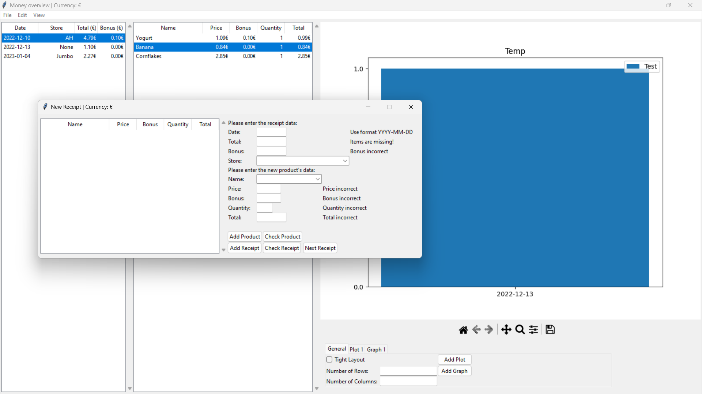

# DataGUI

A program to quickly visualize interesting metrics of added receipts. Receipts can be added by hand,
allowing for the introduction of new products, stores, etc. Automatic checks ensure that mistakes are noticed more
quickly. An example overview of the program can be seen below:

Multiple plots and multiple graphs can be easily generated and modified. Additionally, all of the plot and graph
properties are live updated, allowing for quick-and-easy changes.

As the program is currently still in development, all database changes are only temporary.

To run this program, simply run `gui.py`. 

########################################

To be added in the future:
- Automatic receipt recognition through OCR
- Import and export of databases
- Saving of databases